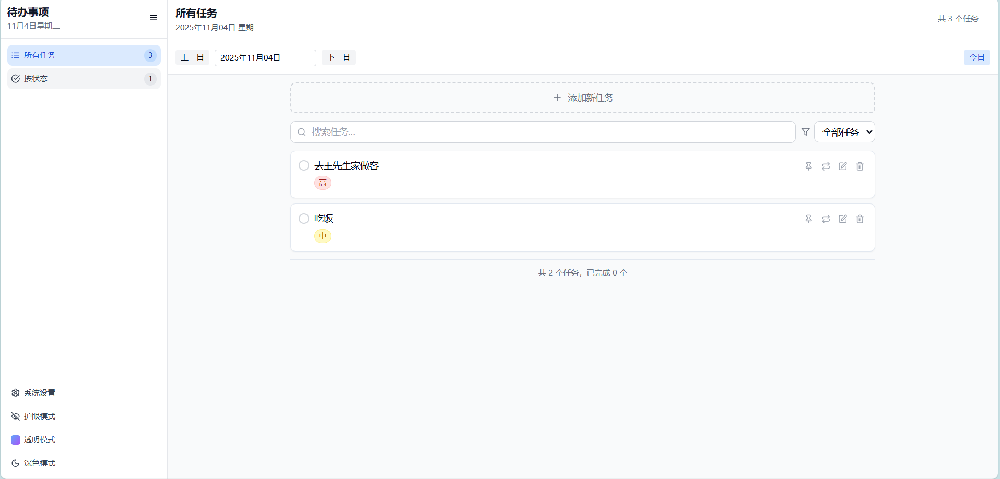
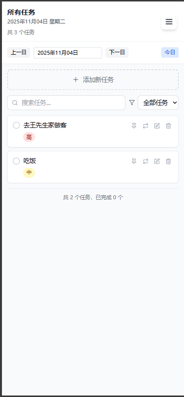

# 待办事项管理系统

一个基于React和Vite构建的现代化待办事项管理应用，具有丰富的功能和优雅的用户界面。

## 项目简介

这是一个功能全面的待办事项管理系统，帮助用户高效地组织和管理日常任务。应用支持多种视图模式、任务分类、优先级设置、常驻任务等高级功能，并提供了深色模式、护眼模式和透明模式等多种视觉体验。

## 功能特点

### 核心功能
- ✅ **任务管理**：创建、编辑、删除和完成任务
- 📅 **日期导航**：按日期查看和管理任务
- 🎯 **优先级设置**：支持高、中、低三种优先级
- 📌 **任务置顶**：重要任务可置顶显示
- 🔄 **常驻任务**：支持每日、每周、每月重复的任务
- 🔍 **搜索过滤**：快速搜索和筛选任务

### 视图模式
- 📋 **所有任务视图**：查看所有任务列表
- 📊 **状态视图**：按完成状态分类查看任务

### 界面特性
- 🌙 **深色模式**：适应不同光线环境
- 👁️ **护眼模式**：减少蓝光，保护视力
- 💎 **透明模式**：现代化的毛玻璃效果界面
- 📱 **响应式设计**：完美适配桌面和移动设备
- 🎨 **个性化设置**：可自定义主题颜色、布局和密度

### 数据管理
- 💾 **本地存储**：数据安全存储在浏览器本地
- 🔄 **实时同步**：任务状态实时更新
- 📈 **任务统计**：直观显示任务完成情况

## 技术栈

- **前端框架**：React 18
- **构建工具**：Vite
- **UI组件**：Radix UI + Tailwind CSS
- **状态管理**：React Query
- **动画效果**：Framer Motion
- **图标库**：Lucide React
- **日期处理**：date-fns

## 项目结构

```
todo-react/
├── src/
│   ├── components/          # 组件目录
│   │   ├── AddTaskForm.jsx  # 添加任务表单
│   │   ├── EditTaskForm.jsx # 编辑任务表单
│   │   ├── Navigation.jsx   # 导航组件
│   │   ├── TaskItem.jsx     # 任务项组件
│   │   ├── TaskList.jsx     # 任务列表组件
│   │   └── ...              # 其他组件
│   ├── hooks/               # 自定义钩子
│   │   └── useTasks.js      # 任务管理钩子
│   ├── pages/               # 页面组件
│   │   ├── Index.jsx        # 首页
│   │   └── Settings.jsx     # 设置页面
│   ├── utils/               # 工具函数
│   │   ├── storage.js       # 本地存储工具
│   │   └── ...              # 其他工具
│   └── App.jsx              # 主应用组件
├── images/                  # 项目图片
│   ├── m-home.png          # 移动端界面
│   └── pc-home.png         # PC端界面
└── ...
```

## 界面预览

### PC端界面


### 移动端界面


## 环境安装指南

### NVM 安装
``` 
curl -o- https://raw.githubusercontent.com/nvm-sh/nvm/v0.39.1/install.sh | bash
```

### Node.js 16 安装
```
nvm install 16
nvm use 16
```

### 项目依赖安装
```
yarn install
```

### 启动开发服务器
```
yarn run dev
```

### 构建生产版本
```
yarn build
```

## 使用说明

1. **添加任务**：点击"添加新任务"按钮，填写任务内容、设置优先级和截止日期
2. **管理任务**：点击任务可编辑，勾选复选框标记完成，点击删除按钮移除任务
3. **设置常驻任务**：勾选"常驻任务"并设置重复周期（每日/每周/每月）
4. **切换视图**：使用左侧导航栏切换不同视图模式
5. **个性化设置**：在设置页面调整主题、布局和界面样式

## 开发说明

本项目采用组件化开发模式，使用React Hooks管理状态，通过React Query处理数据缓存和同步。UI设计遵循现代化设计原则，提供流畅的用户体验。

## 许可证

MIT License
